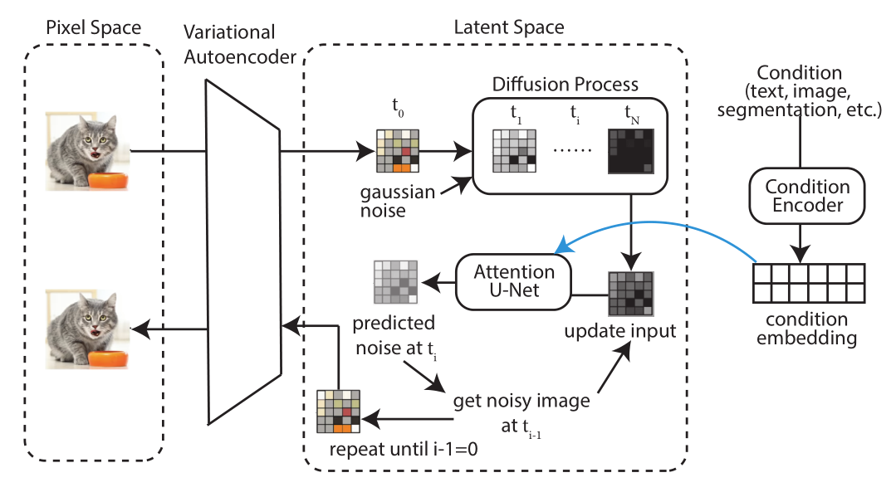
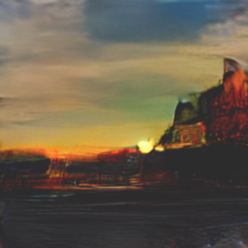
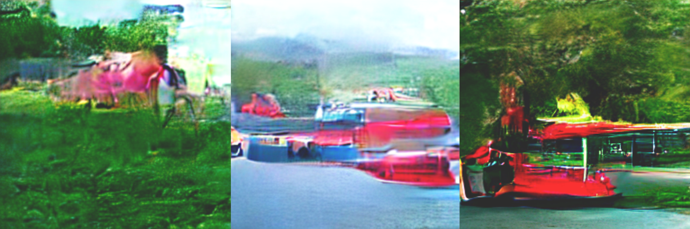
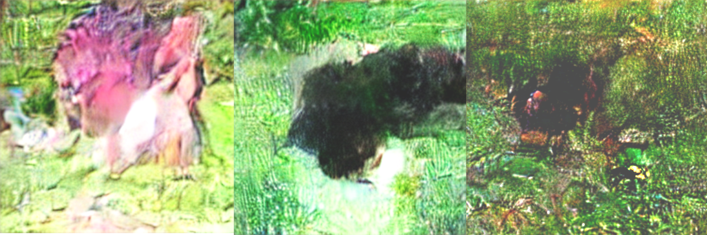

# **Mini-Latent Diffusion Implementation in JAX**

A JAX implementation of **Latent Diffusion**. Visit the ***[Google Colab Notebook](https://colab.research.google.com/drive/1YZqdrmZ4bmJNQZvfoc4FirldroHJgnY2?usp=sharing).***

---

## Overview

This repository implements the core mechanisms of diffusion, including the **Scheduler** and the **U-Net Architecture**. The supporting **Variational Autoencoder (VAE)** and **CLIP** model are frozen and imported. Therefore, you can consider the core paper this code follows as *[Denoising Diffusion Probabilistic Models](https://arxiv.org/pdf/2006.11239)*, with some supporting ideas from *[High-Resolution Image Synthesis with Latent Diffusion Models](https://arxiv.org/pdf/2112.10752)*.

The full pipeline includes noise scheduling, the main U-Net architecture (with cross-attention injected at lower levels), and classifier-free guidance, all written in **JAX/Flax NNX**.

---

## Some Generated Images!

While a full training cycle was not done, we still have some previews on the capabilities of the model, having trained on ***120k MS-COCO*** images for 30 epochs. Enjoy the 3 test samples, which include the prompts `a sunset over the city`, `a red car on a highway`, and `a cat in the grass` respectively. The images are shown from epochs 10, 20, and 30.

### "A Sunset over the City"

This was my favorite! The 30th epoch representation for this prompt shows this artistic image. Although details still lack, you can definitely consider it a beautiful image.

### "A Red Car on a Highway"

We can see the model follow the prompts we gave it. As the epochs pass, you can see the "essence" of a car start being actualized, with some car details starting to show up. However, it still remained relatively abstract.

### "A Cat in the Grass"

This would be what you can consider out "worst" results. Due to the cat's fine features, the representation remained the most abstract, though it is interesting to note the level of detail the grass started getting.

